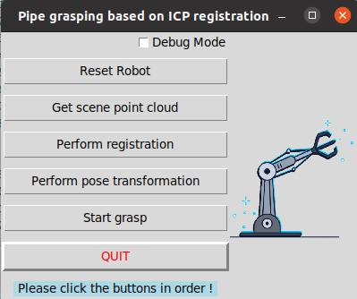

# ICP Grasping project based on ROS

This repository is for creating ROS-based `Iterative closest point (ICP)`  grasping project

## 1. Clone this repository

```bash
cd ~
cd catkin_ws/src
git clone https://github.com/Jaron-G/grasp_icp.git
cd grasp_icp
```

## 2. Environment setup

### 2.1 Docker

Follow the [`readme.md`](./Docker/readme.md) in `./Docker` to create the correct Docker Image.

### 2.2 Dependencies

- ros-noetic

> 📝 **Note**
>
> All of these dependencies have been installed in the docker environment.

### 2.3 Download software source file

The Haclon installation package should be located in `grasp/src/downloads`

Download software source file and save it to the `downloads/` folder in this package (untracked). The folder should be like this after that:

```bash{.line-numbers}
downloads/
└── halcon-23.05.0.0-x64-linux
    ├── readme.txt
    ├── repository
    │   └── packages.mvtec.com
    │       ├── ai_acc
    │       ├── halcon
    │       │   └── halcon-23.05-progress
0-deep-learning-core-x64-win64_x64-linux_aarch64-linux_armv7a-linux.zip
    │       │
    │       ├── interfaces
    │       ├── som.catalog
    │       └── som.catalog.asc
    ├── som
    ├── som-register.sh
    └── som.png
```

### 2.4 Install Halcon and synchronize the dependent packages

The installation of Halcon has been integrated into entrypoint.sh, and every time the container is started, it will automatically synchronize the dependent packages and install Halcon.

```bash
# entrypoint.sh
# Update repositories
cd /catkin_ws/src/robotiq_gripper && git pull
cd /catkin_ws/src/ur10e_gripper && git pull
cd /catkin_ws/src/ur10e_gripper_moveit && git pull
cd /catkin_ws/src/models && git pull
cd /catkin_ws/src/obtain_pcd && git pull
cd /catkin_ws/src/pose_transformation && git pull
cd /catkin_ws/src/move_robot && git pull
cd /catkin_ws/src/halcon_package && git pull
# 安装Halcon
cd /catkin_ws/src/halcon_package/Halcon_install/
bash install.bash 
```

## 3. Start grasp simulation

```bash
 catkin_make
 source devel/setup.bash
 roslaunch grasp_icp manual_sim.launch 
```
+ After startup, the robot in Gazebo is in a paused state, and a graphical interface for robot grasping control pops up. Click the play button in the bottom left corner of Gazebo, and then use the graphical interface to control the robot's grasping.

+ The graphical interface is as follows, press the buttons in sequence to simulate grasping.
+ Debug Mode:
    - print less log info in normal mode
    - show the registration result only in the debug mode


